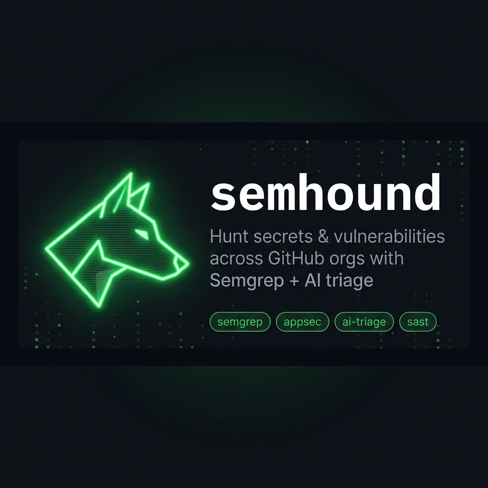

# semhound

[](https://github.com/salecharohit/semhound/actions/workflows/release.yml)
[](https://pypi.org/project/semhound)
[](https://pypi.org/project/semhound)
[](https://pypi.org/project/semhound)
[](LICENSE)

<p align="center">
  
</p>

**semhound** automates Semgrep scanning at org scale — you bring the rules, it handles discovery, cloning, scanning, and reporting across every repository in one or more GitHub organisations or user accounts. Optionally route each finding through an AI provider to triage true vs. false positives with a customised prompt.

Just like [TruffleHog](https://github.com/trufflesecurity/trufflehog) sweeps repos for secrets, semhound sweeps repos for any code pattern you define.

---

## How it works

1. **Discover** — uses `gh repo list` to find every repository for each target (org or user)
2. **Clone** — shallow-clones each repo in parallel (`--depth 1`) via SSH
3. **Scan** — runs your Semgrep rules across every cloned repo
4. **Report** — writes a consolidated CSV (and optional SARIF) per target, with GitHub permalinks to every finding

---

## Use-cases

**Bug bounty SQL injection — identify the same pattern across all repos**

A bug bounty report flagged a SQL injection in one of your apps. Write a Semgrep rule for that pattern and sweep your entire org to find every other repo where the same issue exists.

**Zero-day in a third-party OSS library — find every repo still running the vulnerable version**

A zero-day drops for a widely-used library — think log4j. Write a Semgrep rule that matches that version string in dependency files and sweep all your orgs in one pass. You get an immediate list of every repo still running the vulnerable version so you can prioritise upgrades before the exploit is weaponised.

---

## Prerequisites

The following tools must be installed and on your `PATH`. semhound checks for all of them at startup and prints platform-specific install instructions for anything missing.

| Tool | macOS | Linux | Windows |
|------|-------|-------|---------|
| [GitHub CLI `gh`](https://cli.github.com) — repo discovery | `brew install gh` | [install guide](https://github.com/cli/cli/blob/trunk/docs/install_linux.md) | `winget install --id GitHub.cli` |
| `git` — shallow cloning | `brew install git` | `sudo apt install git` | `winget install --id Git.Git` |
| [Semgrep](https://semgrep.dev) — static analysis | `brew install semgrep` | `pip install semgrep` | `pip install semgrep` |
| OpenSSH — cloning via SSH | ships with macOS | `sudo apt install openssh-client` | ships with Windows 10/11 |

**Authenticate the GitHub CLI** (once):

```bash
gh auth login
```

**Register an SSH key** with your GitHub account (once) so semhound can clone private repos:
[docs.github.com/en/authentication/connecting-to-github-with-ssh](https://docs.github.com/en/authentication/connecting-to-github-with-ssh)

---

## Installation

**Recommended — [`pipx`](https://pipx.pypa.io)** (macOS / Linux):

`pipx` installs CLI tools into isolated virtual environments and makes them globally available — no `venv` management, no system Python conflicts.

```bash
# Install pipx (once)
brew install pipx        # macOS
# or: pip install --user pipx   # Linux

# Install semhound
pipx install semhound
```

**Alternative — `pip`** (inside a virtual environment):

```bash
python3 -m venv .venv
source .venv/bin/activate
pip install semhound
```

**From source** (for local development):

```bash
git clone git@github.com:salecharohit/semhound.git
cd semhound
pip install -e .
```

---

## Usage

```
semhound [ORG_OR_USER ...] [--orgs-file PATH]
  --rules-dir PATH        Local folder of Semgrep .yaml rule files
  --rules-url URL         HTTPS URL of a Semgrep rule file (repeatable)
  --ai-config PATH        AI provider config file (omit to skip AI triage)
  --threads N             Parallel worker threads per target (default: 5)
  --sarif                 Also write a SARIF 2.1.0 report alongside the CSV
```

Pass one or more GitHub org names or usernames inline, load a list from `--orgs-file`, or mix both. All targets are deduplicated and scanned sequentially; each produces its own `<target>_scan.csv`.

```bash
# Single org
semhound acme-corp --rules-dir ./rules

# Single user account
semhound octocat --rules-dir ./rules

# Mix orgs and users inline
semhound acme-corp octocat --rules-dir ./rules

# Load orgs from a file
semhound --orgs-file orgs.txt --rules-dir ./rules

# Org file + inline username
semhound octocat --orgs-file orgs.txt --rules-dir ./rules

# Remote rule — no local files needed
semhound acme-corp \
  --rules-url https://raw.githubusercontent.com/example/rules/main/sqli.yaml

# Full sweep: org file + remote rule + AI triage + 10 threads
semhound --orgs-file orgs.txt \
  --rules-dir ./rules \
  --rules-url https://raw.githubusercontent.com/example/rules/main/extra.yaml \
  --ai-config ai.config \
  --threads 10
```

`orgs.txt` — one org name or username per line; blank lines and `#` comments ignored.

---

## Semgrep Rules

Rules come from a local directory (`--rules-dir`), one or more HTTPS URLs (`--rules-url`), or both. At least one source is required. Rules must be valid Semgrep `.yaml` files. Files downloaded via `--rules-url` are placed in a temporary directory and deleted after the scan.

---

## AI Analysis (optional)

Copy `ai.config.example` to `ai.config`, fill in your credentials, and pass `--ai-config ai.config`. Each finding is sent to the model, which returns a **confidence score** (0–100) and a **true positive** verdict. Without `--ai-config` those columns are left blank.

### Supported providers

| Provider | Required fields | Notes |
|----------|----------------|-------|
| `claude` | `api_key`, `model` | Anthropic direct API |
| `openai` | `api_key`, `model` | OpenAI API |
| `gemini` | `api_key`, `model` | Google Gemini API |
| `bedrock` | `aws_region`, `model` | Uses standard AWS credential chain — no API key needed |

The `system_prompt` field is optional but strongly recommended — tailoring it to your scenario produces sharper verdicts. Use the examples below as a starting point.

### Example: Bug bounty SQL injection sweep — AWS Bedrock

No API key needed; credentials come from `~/.aws/credentials`, an IAM role, SSO, etc. Find model IDs in the AWS Console under **Bedrock → Model access**.

```yaml
provider: bedrock
aws_profile: default      # omit to use the default credential chain
aws_region: us-east-1
model: anthropic.claude-3-5-sonnet-20241022-v2:0

system_prompt: >
  You are an application security engineer triaging SQL injection findings
  flagged by a Semgrep rule after a bug bounty report.
  For each code snippet, assess whether user-controlled input reaches a
  database query without going through a parameterised query or ORM.
  Rate confidence based on how directly the input flows into the query.
  Be concise and precise.
```

### Example: Zero-day library sweep — OpenAI

```yaml
provider: openai
api_key: sk-...
model: gpt-4o

system_prompt: >
  You are an application security engineer triaging findings from a
  zero-day sweep across the org.
  A CVE has been published for a specific function in a third-party library.
  For each code snippet, assess whether the flagged function call matches the
  vulnerable usage pattern described in the CVE, and whether any caller-side
  mitigations such as input validation or version guards are already present.
  Prioritise findings where the dangerous call is reachable with no mitigations.
  Be concise and precise.
```

**Live triage output:**

```
[analyze] my-repo — sqli-raw-format
[ai]      my-repo — sqli-raw-format | confidence=91 true_positive=true
```

If a provider returns an unparseable response, the tool retries up to 3 times with exponential backoff (1 s → 2 s → 4 s) before recording `ERROR`.

---

## Output

Results are written to `<target>_scan.csv`. Pass `--sarif` to also produce `<target>_scan.sarif`.

| Column | Description |
|--------|-------------|
| Repository | Repository name |
| Rule | Semgrep rule ID |
| Issue Description | Rule message |
| Location | GitHub permalink to the exact line |
| Confidence Score (AI) | 0–100 (blank without `--ai-config`) |
| True Positive (AI) | `true` / `false` (blank without `--ai-config`) |

---

## FAQ

### **Who is this tool for?**

semhound is built for **Purple and Blue teams** — security engineers who need to identify vulnerable code patterns at org scale, not one repo at a time. Whether you're responding to a bug bounty report, sweeping for a CVE across an acquired company's codebase, or enforcing a security pattern across 200 repos, semhound gives you the answer in one command.

### **What authentication is needed?**

semhound uses two mechanisms. `gh auth login` creates an OAuth token used for repository discovery via `gh repo list`. Cloning uses SSH with a key registered in your GitHub account — preferred over HTTPS because keys don't expire, are never embedded in URLs, and have no credential helper overhead when cloning hundreds of repos in parallel.

### **Does it scan git history?**
No. semhound does a shallow clone of the default branch (`--depth 1`) and scans the current state of the code. It is designed for broad, fast coverage across many repos, not deep forensic history analysis.

### **How is this different from TruffleHog or Gitleaks?**

TruffleHog and Gitleaks are purpose-built secrets scanners — they detect API keys, tokens, and credentials using their own built-in signatures. semhound is not a secrets scanner. It runs any Semgrep rule you give it — security vulnerabilities, dangerous function calls, vulnerable dependency versions, custom code patterns. Use TruffleHog for secrets; use semhound when you need to hunt for arbitrary code patterns at org scale.

### **How is this different from running Semgrep directly?**

Semgrep is a scanner; it needs a target. Running it directly means you clone each repo yourself, run the command, collect results, repeat. semhound wraps that entire loop — it discovers every repo in an org or user account, clones them in parallel, runs your rules across all of them, and writes a consolidated CSV. One command replaces what would otherwise be a shell script across dozens or hundreds of repos.

### **How is this different from GitHub Advanced Security (GHAS)?**

GHAS must be enabled repository by repository and requires a GitHub Enterprise licence for private repos. semhound works with any GitHub account, needs no per-repo setup, and lets you bring your own Semgrep rules. It runs on demand from anywhere, against any org or user you have access to.

### **How is this different from git-secrets?**

git-secrets is a pre-commit hook that stops developers from committing secrets at commit time. semhound is a retrospective org-wide scanner — it sweeps repositories that already exist, across teams and orgs, looking for patterns you define. Different problem, different tool.

---

## Contributing

Contributions are welcome! Please read [CONTRIBUTING.md](CONTRIBUTING.md) before opening a PR — it covers branch naming, commit message format (Conventional Commits), and how the automated release pipeline works.
